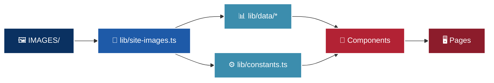

<div align="center">
  <h1>🇺🇸 America: The Greatest Nation</h1>
  <p><em>A cinematic, data-backed Next.js platform celebrating the United States.</em></p>

[](https://nextjs.org/)
[](https://nextjs.org/docs/app)
[](https://www.typescriptlang.org/)
[](https://tailwindcss.com/)
[](https://www.framer.com/motion/)
[](#experience-highlights)
[](#experience-highlights)
[](#image-workflow)
[](#translation-system)
[](https://supabase.com/)
[](https://vercel.com/)
[](#status)

</div>

---

> 🦅 **A patriotic editorial web experience, not a generic template.**  
> The goal of this repo is to make the site feel intentional, premium, data-backed, and unmistakably American.

This repo is not a generic marketing site. It is structured like a content platform:

- homepage as an end-to-end narrative experience
- deep section pages with reusable layout and data components
- centralized image management through `IMAGES/` + `lib/site-images.ts`
- bilingual UI support for English and Romanian
- data-driven content in `lib/data/*` instead of hardcoded JSX
- section verticals that now include both economy and nature/geography

## Quick Snapshot

| Area | What makes this repo interesting |
| --- | --- |
| Visual style | cinematic hero, editorial sections, patriotic palette, strong imagery |
| Content model | facts and media are centralized instead of being scattered in JSX |
| Images | local asset library in `IMAGES/` managed through one registry |
| Internationalization | English + Romanian UI with client + server locale handling |
| Storytelling | homepage is structured like a sequence, not a landing-page template |
| Deep dives | economy and nature already work as real content verticals |

## 🗺️ What Is Built

<details>
<summary><strong>🏠 Core Pages</strong></summary>

- `/` home page with hero, statement, stats, section grid, Why America blocks, map preview, video preview, data teaser charts, quote carousel, gallery preview, newsletter
- `/gallery`
- `/data`
- `/timeline`
- `/explorer`
- `/sitemap`
</details>

<details>
<summary><strong>🦅 The Constitution</strong> (Interactive Civics)</summary>

- `/constitution` full interactive landing page plus deep dives:
  - `/constitution/separation-of-powers`
  - `/constitution/federalism`
  - `/constitution/bill-of-rights`
  - `/constitution/first-amendment`
  - `/constitution/second-amendment`
  - `/constitution/democracy-track-record`
  - `/constitution/unique-features`
</details>

<details>
<summary><strong>📈 The Economy</strong> (Data-Driven Vertical)</summary>

- `/economy` full landing page plus deep dives:
  - `/economy/gdp-growth`
  - `/economy/capital-markets`
  - `/economy/startups-venture-capital`
  - `/economy/dollar-dominance`
  - `/economy/trade-and-exports`
</details>

<details>
<summary><strong>🌲 Natural Majesty</strong> (Geography Vertical)</summary>

- `/nature` full landing page plus deep dives:
  - `/nature/alaska`
  - `/nature/rockies`
  - `/nature/grand-canyon`
  - `/nature/yellowstone`
  - `/nature/great-lakes`
  - `/nature/national-parks`
</details>

<details>
<summary><strong>🎭 Culture & Life</strong> (Scaffolded)</summary>

- `/culture`
  - `/culture/the-american-high-school`
  - `/culture/american-aesthetics`
- `/quality-of-life`
</details>

The culture and quality-of-life pages are currently clean scaffolds with TODO zones, ready for content drops.

## Experience Highlights

- rotating homepage hero with curated local imagery
- animated mega-menu with desktop dropdowns and mobile overlay
- reading progress bar and floating back-to-top button
- data teaser charts with USA-highlighted comparisons
- map preview, video preview, quote carousel, and gallery preview sections
- economy section with full landing page plus five deep-dive routes
- nature section with a full landing page, animated visual components, and six deep-dive routes
- constitution section featuring interactive gear physics, policy sliders, dynamic SVGs, and a 50-state map
- local image library with category folders for easier media management
- Romanian translation mode wired through provider state and cookies
- custom `STATES` homepage title treatment in `StatesVideoTitle.tsx`

## Stack

| Layer | Tech |
| --- | --- |
| Framework | Next.js 16 App Router |
| React | React 18 |
| Styling | Tailwind CSS |
| Motion | Framer Motion |
| Charts | Recharts + D3 |
| Maps | react-simple-maps |
| Forms | React Hook Form + Zod |
| Data / backend | Supabase |
| Deployment | Vercel |
| Analytics | Vercel Analytics + Speed Insights |

## Dev Commands

### Fast Start

```bash
npm install
npm run dev
```

Open `http://localhost:3000`

Available scripts:

```bash
npm run dev         # stable local dev, uses webpack
npm run dev:turbo   # Turbopack variant
npm run build
npm run start
npm run type-check
```

Notes:

- `npm run dev` intentionally uses webpack because this repo previously hit Turbopack stability issues during local development.
- production builds still use standard `next build`.

### Recommended Pre-Push Check

```bash
npm run type-check
npm run build
```

## Environment Variables

Create `.env.local` manually in the project root.

Required values:

```bash
NEXT_PUBLIC_SUPABASE_URL=
NEXT_PUBLIC_SUPABASE_ANON_KEY=
SUPABASE_SERVICE_ROLE_KEY=
```

The service role key is server-only. Do not expose it to the browser.

## Database Setup

This repo uses Supabase for newsletter signup storage.

1. Create a Supabase project
2. Open the SQL editor
3. Run `supabase-schema.sql`
4. Add your environment variables in `.env.local`

Relevant files:

- `app/actions/newsletter.ts`
- `lib/supabase/client.ts`
- `lib/supabase/server.ts`
- `types/database.types.ts`

## Project Shape

```text
app/
  page.tsx                       home page
  layout.tsx                     root shell
  globals.css                    site-wide styles
  economy/                       economy landing + deep dives
  nature/                        nature landing + deep dives
  constitution/                  interactive civics landing + deep dives
  culture/                       culture hub + scaffolds
  quality-of-life/               scaffold
  gallery/ data/ timeline/ explorer/ sitemap/

components/
  layout/                        header, footer, breadcrumb, page chrome
  sections/                      editorial homepage and section components
  data/                          reusable chart components
  nature/                        animated, client-side nature visuals
  constitution/                  interactive SVG animations, physics, and maps
  forms/                         newsletter form
  providers/                     language provider

lib/
  data/                          structured content and stats
  site-images.ts                 central image registry
  constants.ts                   nav, homepage hero, shared site constants
  i18n/                          locale config and server locale helpers
  supabase/                      backend clients
  animations.ts                  motion variants
  utils.ts                       helpers

IMAGES/
  categorized local image library used by the site
```

## 🧭 Content Map

If you are new to the repo, this is the shortest useful mental model:



That flow is the backbone of the project:

- media lives in `IMAGES/`
- image keys are centralized in `SITE_IMAGES`
- content and statistics live in `lib/data/*`
- components render the content
- pages assemble the full experience

## Homepage Architecture

The home page in `app/page.tsx` is intentionally composed from reusable sections.

Key section components:

- `components/sections/HeroSection.tsx`
- `components/sections/StatesVideoTitle.tsx`
- `components/sections/OpeningStatement.tsx`
- `components/sections/StatBar.tsx`
- `components/sections/SectionGrid.tsx`
- `components/sections/WhyAmericaSection.tsx`
- `components/sections/MapPreviewSection.tsx`
- `components/sections/VideoSection.tsx`
- `components/sections/DataTeaserSection.tsx`
- `components/sections/QuoteCarousel.tsx`
- `components/sections/GalleryPreviewSection.tsx`
- `components/sections/NewsletterSection.tsx`

Support utilities mounted globally in the layout:

- reading progress bar
- back-to-top button
- language provider
- analytics and speed insights

### Home Hero Notes

The homepage hero is more custom than the rest of the landing page.

- `HeroSection.tsx` owns the image carousel, particle canvas, parallax motion, CTA row, and title stack
- `StatesVideoTitle.tsx` renders the middle `STATES` line as a masked flag-video treatment
- the top and bottom title lines remain regular DOM text
- if you need to change hero media, start with `lib/constants.ts`, `lib/site-images.ts`, and `public/videos/`

## Feature Flags Without a Feature Flag System

This repo does not use a formal feature-flag service right now, but it is still easy to stage work:

- scaffold a route page and leave TODO zones in place
- wire the route into navigation early if useful
- keep facts in data files so unfinished sections do not contaminate shared components
- keep visual experiments isolated in their own section component

## Image Workflow

This repo is optimized so you can manage images without hunting through JSX.

### The Rule

Do not scatter raw image paths across the app unless there is a good reason.

Use this flow:

1. add the file somewhere in `IMAGES/`
2. import it in `lib/site-images.ts`
3. expose it as a stable `SITE_IMAGES.someKey`
4. consume that key from data files or components

### Where Images Are Typically Wired

- `lib/constants.ts` for nav cards and hero slideshow
- `lib/data/home.ts` for homepage content
- `lib/data/economy-data.ts` for economy pages

### Example

If you want to change a homepage hero image:

1. add the new file to `IMAGES/`
2. import it in `lib/site-images.ts`
3. replace the hero key in `lib/constants.ts`

### Why This Is Better Than Raw URLs Everywhere

- easier swaps
- fewer broken references
- easier reuse across sections
- less chance of Vercel/Linux case-sensitivity failures
- one obvious place to audit what the live site is using

## Content Workflow

Most factual content is intentionally stored in data files.

Main content sources:

- `lib/data/home.ts`
- `lib/data/economy-data.ts`
- `lib/data/nature-data.ts`
- `lib/data/constitution-data.ts`
- `lib/constants.ts`

Use these rules:

- change facts and stats in data files
- change section order in page files
- change visual layout in component files
- change images via `SITE_IMAGES`

### Good Editing Discipline

- use data files for numbers, lists, cards, and repeated text
- keep page files focused on structure
- keep shared visuals inside components
- keep filenames stable once the site depends on them

## Beginner's Guide: Understanding and Modifying the Code

If you're new to React, Next.js, or Tailwind CSS, this project might look complex, but it follows a few simple, repeating patterns. Here is a cheat sheet on what things mean and how to change them safely.

### 1. The Component Pattern (`.tsx` files)
Most files in `components/` or `app/` end in `.tsx`. These are React components. 
Think of a component as a custom HTML tag. 
For example, in `app/page.tsx`, you might see `<StatBar />`. That is not standard HTML; it is a custom block of code defined in `components/sections/StatBar.tsx`. 
- **To change what a component says:** Find the component file (e.g., `StatBar.tsx`), look for the text, and change it. If you don't see the text there, it is likely being passed in from a data file like `lib/data/home.ts`.
- **To change how it looks:** Look at the `className="..."` attribute. We use Tailwind CSS, which means styles are written directly in the class names (e.g., `text-white` makes text white, `mt-4` adds margin-top).

### 2. How the UI "Reacts" to Language (`isRo`)
You will see `{isRo ? "Salut" : "Hello"}` everywhere in the codebase.
- `isRo` is a boolean (true/false) variable meaning "Is Romanian?".
- The `?` and `:` is a ternary operator. It means: "If `isRo` is true, show the first string. Otherwise, show the second string."
- **To modify text:** Always remember to modify both the English and the Romanian strings to keep the site fully translated!

### 3. Understanding Framer Motion (`<motion.div>`)
You will often see `<motion.div>` instead of standard `<div>`. This comes from the Framer Motion animation library.
- **`initial={{ opacity: 0, y: 20 }}`**: How the element looks before it animates in (invisible, pushed down by 20 pixels).
- **`animate={{ opacity: 1, y: 0 }}`**: What the element animates *to* (fully visible, back to its normal position).
- **`transition={{ duration: 0.8 }}`**: How long the animation takes.
- **To change an animation:** Simply adjust these numbers. If you want a slower fade-in, change `duration: 0.8` to `duration: 1.5`.

### 4. How Pages Are Assembled (`app/*/page.tsx`)
In Next.js, any file named `page.tsx` inside the `app/` folder automatically becomes a web page.
- `app/page.tsx` is the homepage (`/`).
- `app/economy/page.tsx` is the economy page (`/economy`).
- These files rarely contain heavy logic or styling. Instead, they act like a "table of contents", stacking pre-built components on top of each other. 
- **To reorder sections:** Simply cut and paste the `<Section>` blocks inside `page.tsx` to rearrange the page layout.

### 5. Managing Colors and Aesthetics
This project uses a highly customized color palette tailored to a patriotic "Vault" theme.
- **Navy Backgrounds:** Usually defined as `bg-[#080B12]` or `bg-navy-dark`.
- **Gold Accents:** Usually `text-[#C9A84C]` or `bg-[#C9A84C]`.
- **Text:** `text-[#F5F0E8]` for primary white text, and `text-[#B8B4AC]` for secondary gray text.
- **To change a color:** Search for these hex codes (e.g., `#C9A84C`) and replace them, but be careful—the site's cinematic feel relies heavily on this specific palette.

### 6. Where the Data Lives (`lib/data/`)
If you want to update statistics (like GDP, population, or historical dates), **do not look in the component files**. 
We keep "facts" separated from "design".
- Go to `lib/data/economy-data.ts`, `lib/data/nature-data.ts`, etc.
- You will see standard JavaScript arrays and objects holding numbers and text.
- Change the data there, and the charts and UI components will automatically update everywhere on the site!

### 7. How to Add a New Page
Next.js uses "file-based routing", which makes adding pages incredibly easy.
1. Inside the `app/` folder, create a new folder for your route (e.g., `app/history/`).
2. Inside that folder, create a file specifically named `page.tsx`.
3. Add a basic React component: 
   ```tsx
   export default function HistoryPage() { 
     return <div className="pt-32 text-center">My History Page</div>; 
   }
   ```
4. Go to `http://localhost:3000/history` in your browser, and you will see your new page!

### 8. How to Change or Add Images
This project strictly organizes images so we don't have broken links scattered across hundreds of files.
1. Place your new image in the `IMAGES/` folder (e.g., `IMAGES/history/founding-fathers.jpg`).
2. Open `lib/site-images.ts` and import it at the top:
   ```ts
   import foundingFathers from "@/IMAGES/history/founding-fathers.jpg";
   ```
3. Add it to the `SITE_IMAGES` object at the bottom of the file.
4. Now, anywhere in the site, you can securely use `SITE_IMAGES.history.foundingFathers.src`.

### 9. SVGs and Interactive Diagrams
If you see `<svg>` tags in the code (like in the map or the Constitution gears), they are drawing graphics directly using math!
- We use SVG (Scalable Vector Graphics) for interactive diagrams because they never lose quality when zoomed in and can be animated smoothly.
- **To change a color in a diagram:** Look for the `fill="..."` (inside color) or `stroke="..."` (outline color) attributes inside the `<path>` or `<circle>` tags.

### 10. Common Errors and How to Fix Them
- **"Hydration failed" or "Text content did not match"**: This happens if the server generates English text, but your browser tries to render Romanian immediately, or if there's a slight mismatch in math calculations. It's a harmless warning in dev mode, but try to keep dynamic math rounded.
- **"Cannot find module"**: You might have deleted a file, renamed it, or misspelled an import path. Check the spelling at the very top of the file!
- **"Cannot read properties of undefined (reading 'src')"**: You forgot to export your image correctly from `lib/site-images.ts`. Go double-check your registry!

## Translation System

The site currently supports:

- English
- Romanian

Core files:

- `lib/i18n/config.ts`
- `components/providers/LanguageProvider.tsx`
- `lib/i18n/server.ts`

How it works:

- client components use the language provider
- server pages read the locale from a cookie
- the header language selector writes both local storage and cookie state

If you add a new route and want it translated:

1. read the locale with `getServerLocale()` in the page
2. create a `copy` object inside the page or data getter
3. render translated labels from that object

### Current Translation Approach

- client surfaces like the header use the language provider
- server routes use cookie-based locale reads
- shared datasets can expose localized getters
- Romanian is treated as a first-class display mode, not a mock toggle

## Reusable Components Worth Knowing

Layout:

- `components/layout/Header.tsx`
- `components/layout/Footer.tsx`
- `components/layout/Breadcrumb.tsx`
- `components/layout/PageChrome.tsx`

Content:

- `components/sections/FactCard.tsx`
- `components/sections/StatCard.tsx`
- `components/sections/QuoteBlock.tsx`
- `components/sections/ParallaxSection.tsx`
- `components/sections/AccordionSection.tsx`

Charts:

- `components/data/GdpBarChart.tsx`
- `components/data/SP500Chart.tsx`
- `components/data/VCCharts.tsx`
- `components/data/DollarMarketCharts.tsx`
- `components/data/NatureCharts.tsx`

Nature-specific visuals:

- `components/nature/NatureAnimations.tsx`

## How Do I Change X?

This is the practical operator section.

### Change homepage section order

Edit `app/page.tsx`

### Change homepage hero images

Edit `lib/constants.ts`

### Change homepage stats, cards, gallery content, videos, or chart data

Edit `lib/data/home.ts`

### Change economy facts, overview text, quote content, or subpage card data

Edit `lib/data/economy-data.ts`

### Change nature facts, overview text, quote content, or subpage card data

Edit `lib/data/nature-data.ts`

### Change constitution data, historical checks, or policy settings

Edit `lib/data/constitution-data.ts` or `lib/data/federalism-data.ts`

### Change header navigation or submenu structure

Edit `lib/constants.ts`

### Change the language options

Edit `lib/i18n/config.ts`

### Change sitewide look and reusable CSS helpers

Edit `app/globals.css`

### Change the `STATES` homepage title effect

Start with:

- `components/sections/StatesVideoTitle.tsx`
- `components/sections/HeroSection.tsx`
- `public/videos/flag-loop.mp4`

## Design Notes

The visual language of the repo is built around:

- `glory-red`
- `glory-blue`
- `glory-gold`
- deep navy backgrounds
- editorial typography
- image-heavy sections with gold accents and patriotic gradients

This is not a neutral design system. If you add new sections, preserve the established tone:

- high contrast
- strong imagery
- premium editorial layout
- patriotic palette
- minimal generic placeholder UI

### Design Principle

If a new section looks like a generic SaaS block, it is probably wrong for this repo.

## AI Notes

This section is for future AI-assisted edits. The goal is to explain how the codebase is intended to work so automated changes preserve the current architecture and visual standard.

### Core Logic

- pages should mostly assemble data and reusable components
- facts, stats, quotes, and repeated cards should live in `lib/data/*`
- shared imagery should be registered through `lib/site-images.ts`
- locale handling should happen near the top of a page or inside localized data getters
- interactive or animated behavior should live in focused client components, not be spread through server page files

### Architectural Decisions

- Next.js App Router is used so pages can stay server-first while interactive sections remain client islands
- the repo is organized by editorial verticals such as `economy` and `nature`, not by generic marketing-page slices
- data files exist to keep factual content maintainable and to stop large pages from turning into copy dumps
- image indirection through `SITE_IMAGES` reduces broken-path bugs and makes media swaps predictable
- analytics and Speed Insights are mounted once in `app/layout.tsx` so observability stays global and consistent

### Visual Decisions

- the site is intentionally cinematic, not neutral
- strong imagery, patriotic color, editorial spacing, and motion are part of the product identity
- charts and stat walls should feel integrated into the narrative, not like dashboard leftovers
- if a new section looks like a generic SaaS feature grid, it is probably off-brand

### Homepage Decisions

- the homepage is a story sequence, not a standard hero-plus-features template
- `HeroSection.tsx` is intentionally dense because it owns a custom visual system: slideshow, particles, parallax, and title treatment
- `StatesVideoTitle.tsx` exists because the middle hero line needed a more art-directed effect than plain text could provide
- homepage sections are broken into separate components so visual experiments stay isolated

### Economy, Nature, and Constitution Decisions

- `app/economy/page.tsx`, `app/nature/page.tsx`, and `app/constitution/page.tsx` are the core editorial hubs in the repo
- they use the same general pattern: hero -> stats -> overview -> charts/media/interactive -> fact cards -> quote -> next routes
- deep-dive subpages are meant to be substantive long-form pages, not thin SEO pages
- new verticals should follow this pattern instead of shipping one shallow landing page

### Editing Rules For AI

- prefer updating data files before adding more hardcoded strings to JSX
- preserve bilingual behavior whenever visible copy changes
- preserve the art-directed visual tone instead of simplifying into generic layouts
- prefer reusable components over inflating already large page files
- when touching imagery, update `SITE_IMAGES` rather than scattering raw imports
- run `npm run type-check` after changes

### Where AI Should Start

| Task | First place to inspect |
| --- | --- |
| Homepage copy or card content | `lib/data/home.ts` |
| Homepage hero behavior | `components/sections/HeroSection.tsx` |
| `STATES` title effect | `components/sections/StatesVideoTitle.tsx` |
| Economy content | `lib/data/economy-data.ts` |
| Nature content | `lib/data/nature-data.ts` |
| Constitution content | `lib/data/constitution-data.ts`, `lib/data/federalism-data.ts` |
| Constitution interactions | `components/constitution/*` |
| Image swaps | `lib/site-images.ts` |
| Locale logic | `components/providers/LanguageProvider.tsx`, `lib/i18n/server.ts` |
| Global shell and analytics | `app/layout.tsx` |

## Deployment

The project is designed for Vercel.

Standard flow:

```bash
npm run type-check
npm run build
```

Then push to GitHub and deploy through Vercel.

If Vercel fails on static image imports:

- check the exact filename casing in `lib/site-images.ts`
- remember macOS may hide case mistakes that Linux CI will reject

### Build Sanity Checklist

- `npm run type-check` passes
- local image paths match real file names exactly
- new routes are linked intentionally
- translated routes still render without client-only assumptions
- no content was hardcoded into JSX if it belongs in `lib/data/*`

## Practical Notes

- keep file names stable once referenced in `SITE_IMAGES`
- prefer editing data files over hardcoding copy in JSX
- prefer adding new sections as components instead of bloating page files
- run `npm run type-check` before pushing
- if a local image changes, hard refresh the browser because Next/Image caching can make swaps look delayed

## Cool Bits In This Repo

- rotating multi-image homepage hero
- homepage data teaser charts with USA-highlighted bars
- animated mega-menu with mobile overlay
- breadcrumb JSON-LD support
- reading progress bar + floating back-to-top button
- local image library instead of scattered remote URLs
- Romanian translation mode wired through real cookie + provider state
- economy section built as a real editorial/data hybrid, not just cards and charts
- nature section built with its own charts, animations, and long-form subpages
- constitution section featuring Bloomberg-grade interactive SVGs, SVG ratchet physics, and a policy sandbox
- homepage hero includes a custom video-backed `STATES` title treatment

## Roadmap Energy

Good next expansions for this repo:

- finish the culture hub with real content blocks and media
- turn quality-of-life from scaffold to full narrative section
- deepen the explorer and gallery experiences
- tighten per-route metadata and translated SEO copy
- expand the Romanian coverage to every remaining visible string
- continue improving the README as the repo gets more opinionated

## Status

| Area | Status |
| --- | --- |
| Homepage | strong and feature-rich |
| Economy | substantial and already production-shaped |
| Nature | substantial and already production-shaped |
| Constitution | fully interactive, production-ready, interactive physics and maps |
| Culture | scaffolded, ready for content |
| Quality of Life | scaffolded, ready for content |
| Translation | live for shared UI and major route content |
| Image system | centralized and local-first |
| README | aligned with the actual repo |

---

Built as a patriotic editorial web experience, not a template.  
Keep the bar high. Use real images, real statistics, and intentional layouts.
